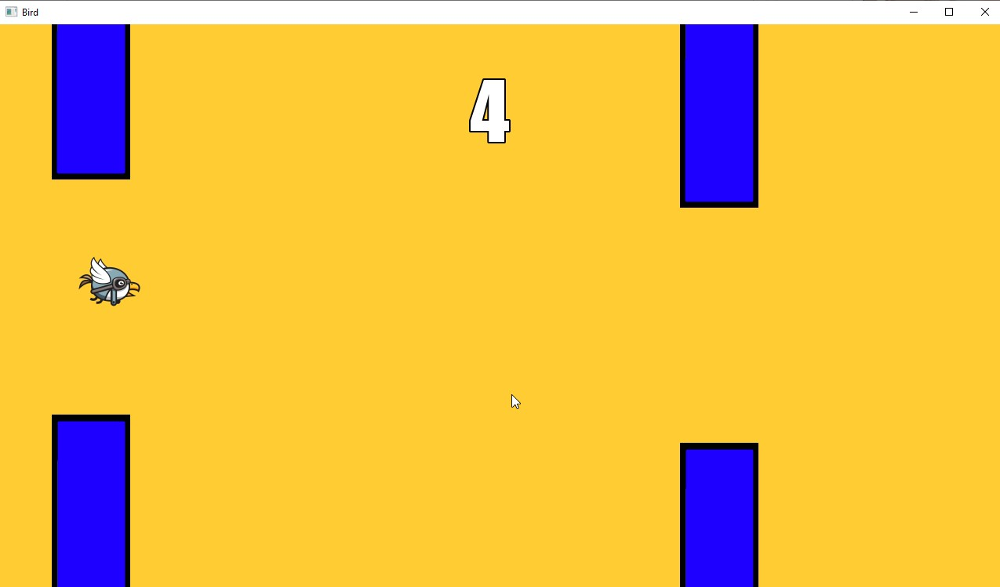

# Bird game

Игра Bird, написанная на С++ с использованием библиотеки SFML.

Меню

Игра

Game Over

# Управление

Меню

- Нажмите кнопку Новая игра, чтобы запуститься игру.
- Нажмите кнопку Выйти, чтобы выйти.

Игра

- Нажмите клавишу "Space" для перемещения вверх.
- Нажмите клавишу Tab для выхода в меню.
- Если птица прикоснётся к препятствию, то игра проиграна.
- При проигрыше появится окно Game Over.

Game Over
- Нажмите кнопку Новая игра для перезапуска игры.
- Нажмите клавишу Tab для выхода в меню.

# Требования
1. Скачать и установить Visual Studio  
https://visualstudio.microsoft.com/
2. Скачать и установить SFML  
https://www.sfml-dev.org/download.php

# Настройка Visual Studio
https://www.sfml-dev.org/tutorials/2.6/start-vc.php

# Клонирование репозитория
git clone https://github.com/nKadykov/bird-game.git
